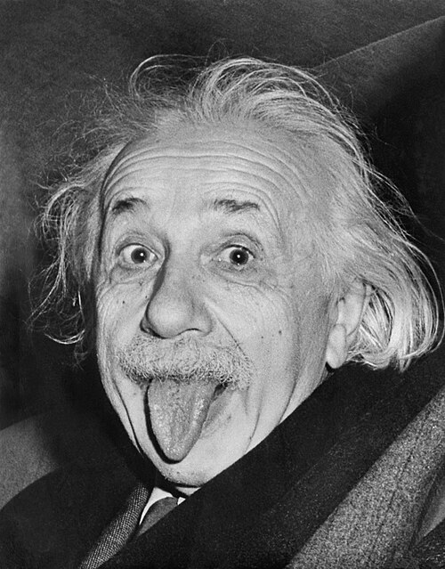
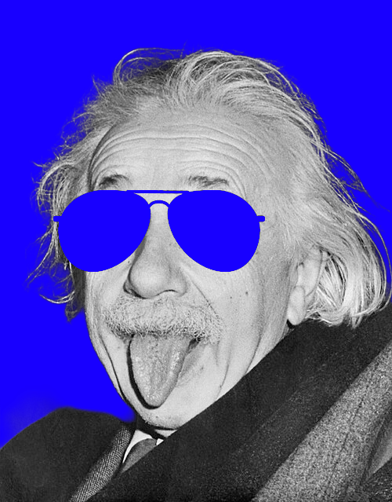
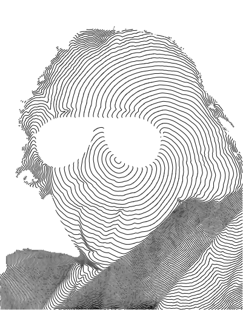

# TopoLines

This tool makes it easy to convert photos into topographic-map-like renderings. This project takes inspiration from [Sierra Mancia’s Marching Waves](https://sierramancia.github.io/marching-waves/), and [Shading from shape, the eikonal equation solved by grey-weighted distance transform](https://www.sciencedirect.com/science/article/pii/0167865590901028).

| Original | TopoLines |
|:---:|:---:|
|  |  |

## How to use
There are several ways to try it out:
- Use the [GitHub Pages](https://tomunderwood99.github.io/TopoLines/)
- Open [`index.html`](index.html) via a local server or in your browser
- Explore the [Notebook](eikonal_testing.ipynb) if you like to code

## How it works
Creating images with this tool is similar to tracking a wave moving through a puddle. Starting
at the seed points, the wave moves outward across the image (our puddle). Dim areas allow
the wave to move rapidly, while bright areas slow it down. The shape of the wave is recorded on a regular interval
until it fully fills the image. The combination of all these shapes creates a unique rendering of the original image.

  

## Masking Functionality
Playing with negative space is a fun addition to these images. To add a mask, edit your image to be
grayscale, and add a monocolored layer over regions you want to exclude. The site will automatically register this layer as a mask.

| Masked input | TopoLines |
|:---:|:---:|
|  |  |